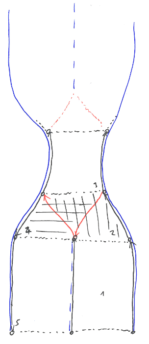

# Architecture

This file describes the architectural decisions which have been made so far and in particular why we decided like we did.

## Overview

<!-- yUML: http://yuml.me/edit/4b9af2c7 or source: %2F%2F Cool Class Diagram, [Primitive|getId();getAttributes();setId();setAttributes()]^-[LineString＃Lanelet], [Primitive]^-[Point＃RegulatoryElement], [PrimitiveData|id;attributes]^-[LineStringData＃LaneletData], [PrimitiveData]^-[Point＃RegulatoryElement], [LineString＃Lanelet]->[LineStringData＃LaneletData], [LineString＃Lanelet]^-[InvertedLineString＃InvertedLanelet], [InvertedLineString＃InvertedLanelet]->[LineStringData＃LaneletData] -->

The ＃ symbol stands for alternative readings:  
LineString and Lanelet (and the corresponding InvertedX and XData) are actually two boxes, but share the same inheritance and association and thus have been compacted into one class.  
Point and RegulartoryElement are only placeholders for non-invertible elements of the map.

## Goals

### Identity

Each final element is supposed to have an id that is unique within the whole map. Therefore, each creation of a final element requires a query to a central id counter that is then uniformly increased. For temporary elements, we introduced the id INVAL_ID so no ids are wasted and the (thread-safe and thus expensive) id querying can be omitted.

### Data Singularity

As each element only represents a view on a map data point, we enforce shared pointers. This avoids copies of one single element that could be changed independently which would inevitably lead to data corruption in form of divergence.

### Modularity

The elements of the lanelet map (like Points, LineStrings, Lanelets, RegulatoryElements etc.) should be visible as parallel modules with shared functionality (an id and attributes). This results in the common Primitive parent class.

### Invertibility

Some of the elements (like LineStrings and Lanelets) should be invertible, but the InvertedX should only represent another view on the very same data. Furthermore, you should be able to treat an InvertedX like an X. These requirements result in the common XData class that stores the actual data. 

InvertedX then inherits from X and inverts the setter and getter operations on the actual data (i.e. points() of an InvertedLineString returns the inverted_points() of the underlying LineStringData object).

### Caching

As some operations (like inversion) might be needed quite often in some contexts, but never in some ohters, we will cache some data. Caching is done in the XData objects as thus cache invalidation is rather simple. 

If an object is not invertible, caching can be done directly within the object.

## Layers

The lanelet2 map and thus liblanelet2 have three hiearchical layers which are connected in a bottom-up approach:

- Physical objects like lane markings, curbs, trees, signs etc. form the foundation of the map. They form the physical layer which is expressed using Points and LineStrings.
- Lanelets comprise of such physical objects, in particular LineStrings. They form a lane-level map which planning users can use.
- Above the lanelets, there is a further layer which handles routing (in a routing graph that knows connectivity of single lanelets), traffic rules etc.

## Routing Modes

There are three basic operation modes for the routing/querying:

- In normal operation, the lanelet map does routing over lanelets that are connected in the routing graph. If lanelets are drivable in both directions, they can be part of a route. Using the InvertedLanelet wrapper, this opposite direction driving should be transparent for the user. 
- For overtaking or similar maneuvers, the user can query for connected lanelets even though they are then inverted. In this mode, **the user** has to check whether a lanelet should be left ASAP as it is driven in the wrong direction or whether the current lanelet is correctly oriented and can be driven safely.
- For freespace planning, there is a query mode on the physical layers. In a region growing-like manner, for a certain range and a given position, all drivble space is returned that is given by a user-defined border tpye (like road border, solid line marking, curb, ...). **Important:** This requires an end-of-world border for the whole map!

## Further Issues

##### Inverted lanelets and driving in the opposite direction

To check whether a lanelet is currently driven in opposite direction, the library will take into account left and right border as well as an *isDrivableInBothDirections* (or similar named) attribute. Left and right border uniquely define the direction of a lanelet. If it is not drivable in both directions, *oppositeDirection* can be true.

##### Conflicting lanelets

If two lanelets are crossing each other, the routing layer will be able to tell this. This will also be true for lanelets which are drivable in both directions as they natively conflict with their InvertedLanelets.

##### How to resolve Max' hose problem

Max hose problem consists of two streets with one lane per direction. However, they are connected via a single-lane street without any border between the driving directions. The actual problem is how to represent it and the solution is depicted here:

Lanelets 1, 3 and 5 are obvious. 1 and 5 share the common LineString in the center which is actually *on* the dashed lane marking. To connect lanelet 3 with 1 and 5, we currently *need* lanelets 2 (vertically striped) and 4 (horizontally striped) which have one border/LineString of virtual type (red). Also, they are by default mutually conflicting like 3 is with itself (see above).

Similar situations are the connection parts of roundabouts that can be resolved in a similar manner using lanelets with virtual borders.

Virtual borders are there for the normal mode routing. Should a sidestepping maneuver be necessary, the region growing mode can be used to find the actual (physical) road border.

##### Exceptions

All exceptions are called XError and shall inherit from LaneletError.