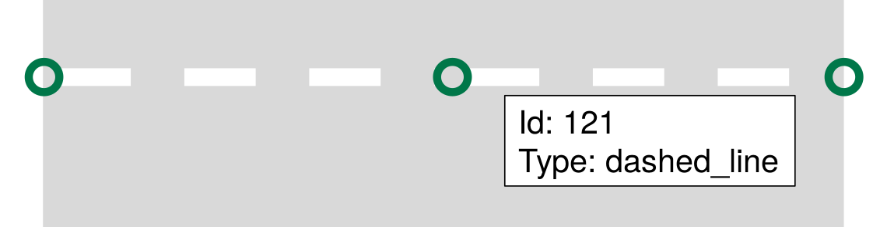
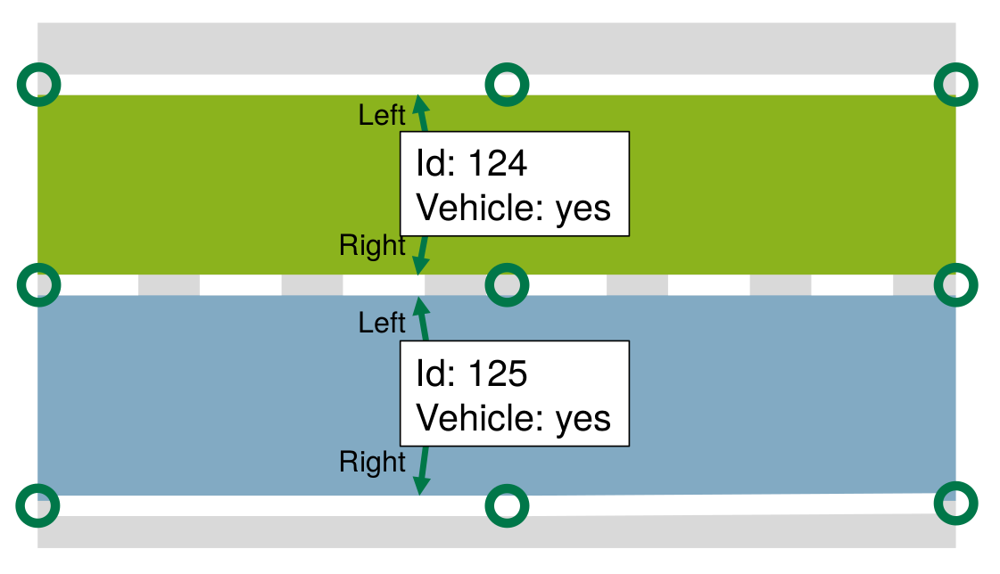
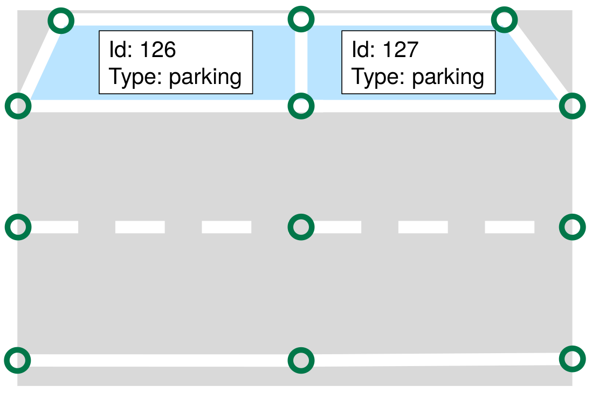
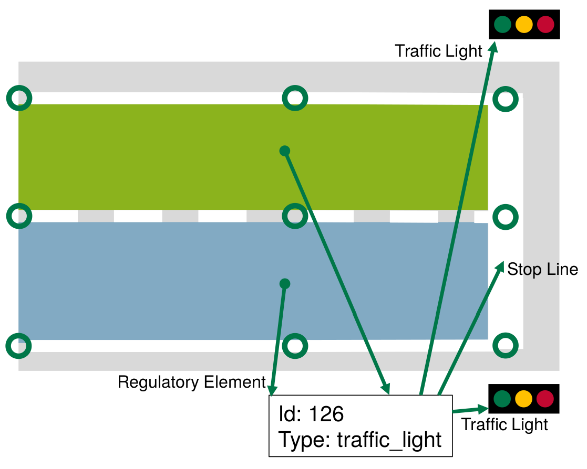

# Lanelet Primitives

Lanelet2 divides the world into a hierarchical structure of six different primitives: Points, linestrings, polygons, lanelets, areas and regulatory elements.

This article focuses on how the primitives are meant to be used, what properties they have and how they are meant to be used. For the technical side, please refer to the [architecture](Architecture.md) page.

## Primitives
All primitives have in common that they have a unique ID and attributes in form of key/value (or tag/value) pairs. There is generally no limit on what tags can be used, but some tags convey a special meaning. Also, tags that are common on lanelet primitives are internally stored in a structure that allows for a more efficient access than custom tags.

Tags are always lowercase and underscored. Some values have a special meaning, e.g. "yes" and "no" which are convertible to bool (yes->true, no->false).

Some tags are used across all primitives:
* **type**, denotes the category that a primitive belongs to. E.g. `curbstone`, `traffic_sign` or `line_thin` for a road marking.
* **subtype** is used to further distinct the type. E.g. `low` to mark a passable curbstone or `dashed` to mark a dashed road marking
* **no_issue** (yes/no): Suppresses warnings on this primitive reported by lanelet2_validation if *yes*.

## Points

A point consists of an ID, a 3d coordinate and attributes. The Id must be unique to a point. Points are no meaningful objects in Lanelet2 per se. Points are only meaningful together with other objects in Lanelet2. The only situation where individual points are important is when tagging start and end points of a dashed line marking.

### Coordinate System
Lanelet2 assumes that maps layed out in the x-y plane. Since the road geometry tends to be flat, that gives the z-Coordinate a less important meaning than the other coordinates. Points can therefore simple be converted to a 2D point where the z-Coordinate is ignored. Still, 3D information is important when roads overlap so that it can be determined if two roads are actually intersecting or just crossing each other at a different height. When determining height information, is generally assumed that the heigt is metric and with respect to WGS84 (i.e. the distance to the earth ellipsoid). For more details on geometry calculation, see [here](GeometryPrimer.md).

It is still possible to follow a "2.5D"-Approach so that the height is generally 0 and only deviates to distinguish between bridges or tunnels. This approach might require configuring the routing graph differently, so that a height distance of 1 (meaning a new layer) is not wrongly interpreted as 1**m** (this would be interpreted as two conflicting lanes).

## Linestrings

Linestrings (also known as polylines or linestrips) are defined by an ordered list of points with linear interpolation in between. They are the basic building block of a lanelet map and used for any phisically observable part of the map.

Linestrings must consist of at least one point to be valid and must not self-intersect. They must not contain points repeatedly (i.e. p1->p2->p2->p3 is not allowed). Linestrings must always have a *type* so that their purpose can be determined.

The tags used to define the individual linestrings are explained [here](LinestringTagging.md).

## Polygon

Polygons are very similar to linestrings, but form an area. It is implicitly assumed that the first and the last point of the polygon are connected to close the shape.

Polygons, are rarely used to transport mapping information (except for e.g. traffic signs). Instead, they often serve as a means to add customized information about an area to the map (e.g. a region of interest).

## Lanelet

A lanelet represents one *atomic* section of a lane. Atomic means that along a lanelet, traffic rules (including possible lane changes to other lanelts) do not change.

A lanelet consists of exactly one left and exactly one right linestring. Together they form the drivable area of the lanelet. It is required that the linestrings point into the same direction. That can mean that for two neighbouring, opposing lanelets one of them has to hold an inverted linestring as its border. When loading map data from osm, the library will do the alignment for you. If possible, the bounds should have a physical motivation (i.e. reference actual markings, curbstones, etc). The type of the boundary is used by the library to determine if lane changes are possible here.

lanelets may have an additional centerline to guide the vehicle. This centerline must be within the area formed by the left and right bound and must not touch the boundaries. If no centerline is given, the library will calculate it for you.

By default, lanelets are one-directional. Only if they are tagged as bidirectional, they are treated as such. Adjacent lanelets have to share the same endpoints so that the Lanelet2 can determine their status of being adjacent. Lanelets can also *diverge* when two or more lanelets are successors of a lanelet. Lanelets that are reachable by a lane change must share one of their borders.

A lanelet can reference *regulatory elements* that represent traffic rules that apply to the lanelet. Multiple lanelets can reference the same regulatory element.

It must always be possible to determine the current speed limit of the lanelet directly from the lanelet. This can either be done by referencing a SpeedLimit regulatory element or by tagging the *location* of the lanelet. In this case the maximum speed for the type of road is assumed (e.g. max 50kph if the location is a german city).

It must also be possible to determine the *participants* that are able to use the lanelet.

For more details on the exact tags of a Lanelet, please read [here](LaneletAndAreaTagging.md).

## Area

An Area has similar properties like a Lanelet, but instead of representing *directed* traffic from entry to exit, an area represents *undirected* traffic within its surface. An Area can have multiple entry and exit points. A typical example of an area would be squares that are used by pedestrians or parking lots and emergency lanes for vehicles. Similar to lanelets, traffic rules must not change on the areas.

Geometrically, an Area is represented by an ordered list of linestrings that together form the shape of the area in *clockwise* orientation. Areas must share exactly one linestring with an other area to be considered adajacent. For lanelets they either have to share one Linestring (when the lanelet is parallel to the area) or the endpoints of the lanelet are also the endpoints of one of the linestrings of the area (when the lanelet leads into the area). The area of an Area must not be zero and the bounds must not self-intersect.

The type of the shared boundary determines whether it is possible to *pass* from/to an area.

Areas can also have *holes*, i.e. parts of the area that are not acessible. It is not allowed that another Lanelet/area is within the hole of a bigger area. In this case, the "outer" area has to be split in two along the hole. Holes are represented similar to the outer bound: each by an ordered list of linestrings that together form the shape of the hole. The points must be in *counter-clockwise* order.

Tags that are applicable to lanelets also apply to Areas (where it makes sense). See [here](LaneletAndAreaTagging.md) for more.

Similarly to lanelets, Areas can refer to regulatory elements. Also, it must be possible to determine the pupose of the Area as well as by which participants it is usable.

## Regulatory Elements

Regulatory elements are a generic way to express traffic rules. They are referenced by lanelets or Areas for which they apply.

In general, Regulatory elements consist of tags that generally express the type of the rule (i.e. a *traffic light* regulatory element) and specific information about the observable things that have a certain *role* for this rule (e.g. the traffic light itself and the stop line). Other types of regulatory elements are *right of way* and *traffic sign* regulatory elements. The list ist not closed at all, it is up to you to plug in more regulatory elements when necessary.

For more information how to tag the build-in regulatory elements, please read on [here](RegulatoryElementTagging.md).

 
