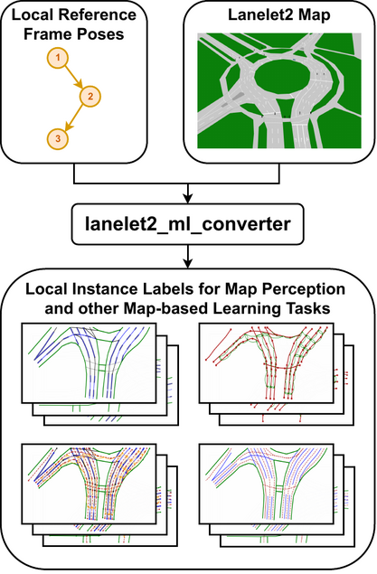

# Lanelet2 ML Converter

Converter module to convert Lanelet2 maps into local instance labels for machine learning tasks.

**Note:** This module is experimental, so the documentation is still sparse and there may be breaking API changes in the future!



## Usage Examples

### Python

```python
import lanelet2
from lanelet2.core import BasicPoint2d
from lanelet2.ml_converter import MapDataInterface

pos = BasicPoint2d(10, 10)                              # set your local reference frame origin
yaw = 0                                                 # set your local reference frame yaw angle (heading)
mDataIf = MapDataInterface(ll2_map)                     # get the MapDataInterface object and pass the ll2 map
mDataIf.setCurrPosAndExtractSubmap2d(pos, yaw)            # extract the local submap 
lData = mDataIf.laneData(True)                          # get the LaneData local instance labels
tfData = lData.getTensorInstanceData(True, False)        # get the local instance labels as numpy arrays
```

### C++
```c++
#include "lanelet2_ml_converter/MapData.h"
#include "lanelet2_ml_converter/MapDataInterface.h"
#include "lanelet2_ml_converter/MapInstances.h"

using TensorData = lanelet::ml_converter::LaneData::TensorInstanceData;

lanelet::BasicPoint2d pos(10, 10);                      // set your local reference frame origin
double yaw = 0;                                         // set your local reference frame yaw angle (heading)
MapDataInterface mDataIf(laneletMap);                   // get the MapDataInterface object and pass the ll2 map
mDataIf.setCurrPosAndExtractSubmap2d(pos, yaw);                    // extract the local submap 
lanelet::ml_converter::LaneData lData = mDataIf.laneData(True);  // get the LaneData local instance labels
TensorData tData = lData.getTensorInstanceData(True, False);      // get the local instance labels as Eigen mats
```

## Features

- Access lanelet map information as numpy arrays from python, in a representation directly usable for machine learning tasks
- Compound labels for independence from map annotation artifacts
- Full traceability to the underlying map element for all instances, including the compound instances
- Real-time capable optimized C++ implementation (around 3 ms for one set of local instance labels)
- Save and load generated labels in both binary and human-readable XML format


## Components

### `MapDataInterface`

Main interface class that is used to generate `LaneData` objects.

### `LaneData`

`LaneData` objects hold all local instance labels of a local reference frame pose.

### `TensorInstanceData`

Subclass of `LaneData` that holds all local instance labels in a convenient numpy array / Eigen matrix form.

### `LaneLineStringInstance` / `CompoundLaneLineStringInstance` / `LaneletInstance` / ...

Each object of these classes holds a single instance label. You can access various information such as the map element ID and the raw or partially processed LineStrings.

## Important to know

- **Road border tagging**: To correctly recognize road borders, they must be tagged as such! It is not possible to automatically recognize untagged road borders, they will be processed as lane dividers.
- **Python numpy arrays**: To make it possible to convert the underlying Eigen matrices to numpy arrays, they are copied for each access (such as calling `getTensorInstanceData`). This means that if you change a numpy array returned from a function like this, the underlying Eigen matrix or object will not be modified! 