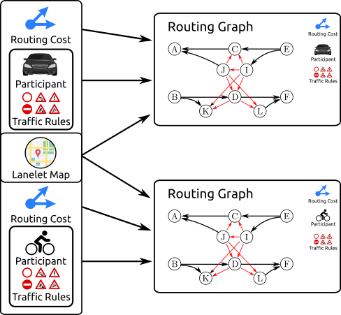
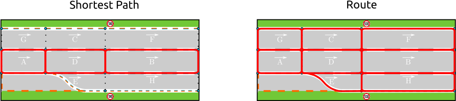

# Lanelet2 routing

The routing module for lanelet2.

For a short version of this you can also look at [the presentation](https://htmlpreview.github.io/?https://github.com/fzi-forschungszentrum-informatik/Lanelet2/blob/master/lanelet2_routing/doc/lanelet2_routing.html). If some images do not render correctly, please clone the repository and open the html file in your browser.

This readme covers some basics. The API offers more than that.

# 1. Components and Vocabulary
## How to create a Routing Graph


The needed components to create a routing graph are:

**Routing Cost Modules:**
* They generically determine the routing cost for travelling along a lanelet/area
* Can be e.g. length, travel time
* You can dynamically select between them when querying the routing graph
* **You can easily plug in your own routing cost calculation**
* *Influences the prefered path*

**Traffic Rules for a Specific Participant** (see [lanelet2_traffic_rules](../lanelet2_traffic_rules/README.md))
* Determines which lanelets/areas are passable
* *Influences the possible paths*

**Lanelet Map:** (see [lanelet2_core](../lanelet2_core/README.md))
* Map with Lanelets, Areas, Regulatory Elements, ...

## Relations
Lanelets that are part of a routing graph can have relations to each other:


The possible relations are:
    * `left`, `right` (reachable via lane change)
    * `adjacent left`, `adjacent right` (lanelets that are neighbours but not reachable via lane change)
    * `succeeding` (relation between two subsequent lanelets)
    * `conflicting` (intersecting lanelets/areas)
    * `area` (reachable area to lanelet/area relation)

## Route vs Path vs Sequence
When querying data in the routing graph, you will come across the terms _route_, _path_ and _sequence_. In contrast to a simple set of lanelets (data-wise a vector of lanelets), they have a special meaning and are data-wise different classes.

A *route* means all the lanelets that can be used to a destination without driving a different road. They can be connected by a generic sequence of lane changes and successors.

A *path* (LaneletPath or LaneletOrAreaPath) is an ordered list of Lanelets/Areas that lead to the destination. They can be connected by lane changes.

A *sequence* (LaneletSequence) is a sequence of subsequent Lanelets that is not separated by a lane change (think of it as a _lane_). It does not necessary lead to a destination, instead it ends when a lane change is required. In the example image, the lanelets A, D, B form a valid _sequence_ (and also a valid _path_), while the lanelets A, D, E are a valid _path_, but not a valid _sequence_.



# 2. Code Usage

## Create a Routing Graph

```cpp
using namespace lanelet;

// Load a map
LaneletMapPtr map = load("map.osm", Origin({49, 8})); // origin has to be close to the map data in lat/lon coordinates

// Initialize traffic rules
TrafficRulesPtr trafficRules{TrafficRulesFactory::instance().create(Locations::Germany, Participants::Vehicle)};

// Optional: Initalize routing costs
double laneChangeCost = 2;
RoutingCostPtrs costPtrs{std::make_shared<RoutingCostDistance>(laneChangeCost)};

// Optional: Initialize config for routing graph:
RoutingGraph::Configuration routingGraphConf;
routingGraphConf.emplace(std::make_pair(RoutingGraph::ParticipantHeight, Attribute("2.")));

// Create routing graph
RoutingGraphPtr graph = RoutingGraph::build(map, trafficRules /*, costPtrs, routingGraphConf*/);
```
- The traffic rules object represents the view from which the map will be interpreted. Doing routing with vehicle traffic
rules will yield different results than routing with e.g. bicycle traffic rules.
- Routing for bicycles might include lanelets that are not available to (motorized)vehicles and vice versa.

The python interface works similarly:
```python
import lanelet2
map = lanelet2.io.load("map.osm", lanelet2.io.Origin(49, 8))
trafficRules = lanelet2.traffic_rules.create(lanelet2.traffic_rules.Locations.Germany, lanelet2.traffic_rules.Participants.Vehicle)
graph = lanelet2.routing.RoutingGraph(map, trafficRules)
```
## Get a shortest path

```cpp
Optional<routing::LaneletPath> shortestPath = graph->shortestPath(fromLanelet, toLanelet);
```
* `Optional` will be uninitialized (false) if there's no path
* there's also `shortestPathWithVia`

in python:
```python
shortestPath = graph.shortestPath(fromLanelet, toLanelet)
```
In python, shortestPath simply returns `None` if there is no path.

## Get and write a route

```cpp
    Optional<Route> route = graph->getRoute(fromLanelet, toLanelet, routingCostId);
    if (route) {
        LaneletSubmapConstPtr routeMap = route->laneletSubmap();
        write("route.osm", *routeMap->laneletMap(), Origin({49, 8}));
    }
```
* `Optional` will be uninitialized (false) if there's no route

Note that there is a semantic difference between a `LaneletSubmap` and a `LaneletMap`. While a LaneletSubmap only contains
the things you explicitly added, the `LaneletMap` also contains all the things referred by them (the Points, Linestrings, things referred by RegulatoryElements).
The `LaneletSubmap` in this case only contains the Lanelets of the route. But since this is not sufficient for writing, you need to transform it into a regular `LaneletMap` first.

The written map will therefore not only contain the Lanelets but also their RegulatoryElements.
If these RegulatoryElements contain other Lanelets, these Lanelets will be part of the written map as well, even if they are not on the route.

in python:
```python
route = graph.getRoute(fromLanelet, toLanelet, routingCostId)
if route:
    laneletSubmap = route.laneletSubmap()
    lanelet2.io.write("route.osm", laneletSubmap.laneletMap(), lanelet2.io.Origin(49, 8)))
```

## Get a reachable set of lanelets

```cpp
double maxRoutingCost{100};
ConstLanelets reachableSet = graph->reachableSet(lanelet, maxRoutingCost, routingCostId);
```

## Left, Right, Following Lanelets

```cpp
// Get routable left lanelet if it exists
Optional<ConstLanelet> left{graph->left(fromLanelet)};
// Get non-routable left lanelet if it exists
Optional<ConstLanelet> adjacentLeft{graph->adjacentLeft(fromLanelet)};
// Get following lanelets
ConstLanelets following{graph->following(fromLanelet)};
```
* Also available: `right`, `adjacentRight`, `lefts`, `rights`, `conflicting`

Alternatively:
 or queries that return relations:
```cpp
// Get relations to all left lanelets
LaneletRelations leftRelations = graph->leftRelations(
                                                fromLanelet);
```
There's `leftRelations` that returns a vector of pairs of LaneletRelations whereas RelationType can be 'left' or 'adjacentLeft' in this case

## More

This is just a quick walkthrough. Advanced examples can be found in [lanelet2_examples](../lanelet2_examples/README.md).

# 3. Export and Debugging Routing Graphs


## LaneletMap with Routing Information

```cpp
LaneletMapConstPtr debugLaneletMap = graph->getDebugLaneletMap(RoutingCostId(0));
write(std::string("routing_graph.osm"), *debugLaneletMap);
```
This one is best viewed in [JOSM](https://josm.openstreetmap.de/) and using a custom map style css which is to be found in `res/routing.mapcss`. [This gif](https://josm.openstreetmap.de/attachment/wiki/Styles/addstyle.gif) shows, how to add a style to JOSM, except that one needs to press the `+` button in the configuration menu and specify the file.

Most of the information is to be found in the attributes. The line strings that connect lanelets do have a direction. The name of the forth-direction is generally to be found left/above the line and the reverse relation right/under the string.

## DOT (GraphViz) and GraphML (xml-based) file export

```cpp
graph->exportGraphViz("~/graph.gv");
graph->exportGraphML("~/graph.graphml");
```
These can then be viewed with a graph viewer like [Gephi](https://gephi.org/). The downside compared to the laneletMap export is, that the lanelets aren't localized.

# 4. Routes

Example route through `Oststadtkreisel`:


Output of `getDebugLaneletMap()` function:


## Example Relational Queries on Routes:

```cpp
// Get left lanelet of example lanelet 'll'
Optional<ConstLaneletRelation> left = route->leftRelation(ll);
// Get conflicting lanelets of 'll'
ConstLanelets conflicting = route->conflictingInRoute(ll);

```
Note that a route just returns relations to lanelets that can be used to reach the goal.
## Other example queries:

```cpp
// Get underlying shortest path
Optional<routing::LaneletPath> shortestPath = route->shortestPath();
// Get the full lane of a given lanelet 'll'
LaneletSequence fullLane = route->fullLane(ll);
// Get remaining lane of a given lanelet 'll'
LaneletSequence remainingLane = route->remainingLane(ll);
```

# 5. Interconnect Routing Graphs of Different Participants
A `RoutingGraphContainer` can be used to *connect* graphs of different participants to get information about conflicting lanelets.
## Create a RoutingGraphContainer

```cpp
std::vector<RoutingGraphPtr> graphs;
graphs.emplace_back(vehicleGraphLaneletMap);
graphs.emplace_back(pedestrianGraphLaneletMap);
RoutingGraphContainer container(graphs);
```
## Example Queries
The last parameter *participantHeight* is optional and decides whether conflicting lanelets are determined in 2D or 3D.

### Query for a single lanelet

```cpp
double heightClearance{4.}; // Height of the traffic participant
// Query a single graph for conflicting lanelets
size_t routingGraphId{0};   // E.g. 0 for the first graph
ConstLanelets conflictingVehicle{container->conflictingInGraph(bridgeLanelet, routingGraphId, heightClearance)};
// Query all graphs for conflicting lanelets
RoutingGraphContainer::ConflictingInGraphs conflicting{container->conflictingInGraphs(bridgeLanelet, heightClearance)};
```

### Query for a Whole Route

```cpp
// Conflicting lanelets of a route in a single graph
ConstLanelets conflictingVehicle{container->conflictingOfRouteInGraph(routePtr, routingGraphId)};
// Conflicting lanelets of a route in all graphs
RoutingGraphContainer::ConflictingInGraphs result{container->conflictingOfRouteInGraphs(routePtr, heightClearance)};
```
